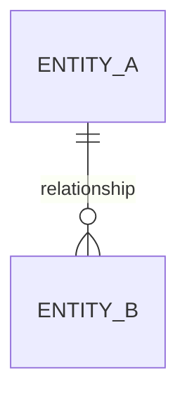
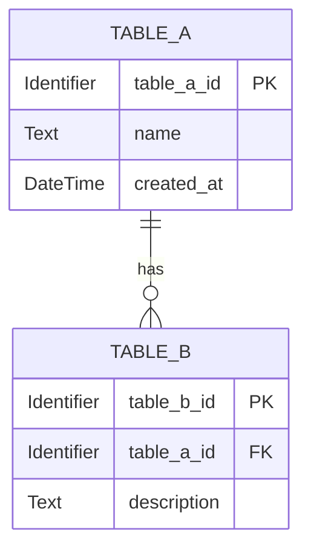

# Software Requirements Specification

## Table Of Contents

- [0. Document Control](#0-document-control)
  - [0.1 Document Information](#01-document-information)
  - [0.2 Revision History](#02-revision-history)
  - [0.3 Review And Approval](#03-review-and-approval)
- [1. Introduction](#1-introduction)
  - [1.1 Purpose](#11-purpose)
  - [1.2 Scope](#12-scope)
    - [1.2.1 In Scope](#121-in-scope)
    - [1.2.2 Out Of Scope](#122-out-of-scope)
    - [1.2.3 Future Scope](#123-future-scope)
  - [1.3 Intended Audience](#13-intended-audience)
  - [1.4 Definitions, Acronyms And Abbreviations](#14-definitions-acronyms-and-abbreviations)
  - [1.5 References](#15-references)
  - [1.6 Document Overview](#16-document-overview)
- [2. Overall Description](#2-overall-description)
  - [2.1 Product Perspective](#21-product-perspective)
    - [2.1.1 System Boundary](#211-system-boundary)
    - [2.1.2 Context Diagram](#212-context-diagram)
  - [2.2 Product Functions](#22-product-functions)
  - [2.3 User Classes And Characteristics](#23-user-classes-and-characteristics)
  - [2.4 Operating Environment](#24-operating-environment)
  - [2.5 Design And Implementation Constraints](#25-design-and-implementation-constraints)
  - [2.6 Assumptions And Dependencies](#26-assumptions-and-dependencies)
- [3. Stakeholders, Actors And External Systems](#3-stakeholders-actors-and-external-systems)
  - [3.1 Stakeholders](#31-stakeholders)
  - [3.2 Actors](#32-actors)
  - [3.3 Actor Permission Overview](#33-actor-permission-overview)
  - [3.4 External Systems](#34-external-systems)
- [4. Business Context](#4-business-context)
  - [4.1 Problem Statement](#41-problem-statement)
  - [4.2 Business Goals](#42-business-goals)
  - [4.3 Success Criteria](#43-success-criteria)
  - [4.4 Current Workflow](#44-current-workflow)
  - [4.5 Target Workflow](#45-target-workflow)
- [5. Product Features](#5-product-features)
  - [5.1 Feature List](#51-feature-list)
  - [5.2 Feature Details](#52-feature-details)
    - [F-DOMAIN-NNN - Feature Name](#f-domain-nnn---feature-name)
- [6. Use Case Specifications](#6-use-case-specifications)
  - [6.1 Use Case Overview](#61-use-case-overview)
  - [6.2 Use Case Details](#62-use-case-details)
    - [UC-DOMAIN-NNN - Use Case Name](#uc-domain-nnn---use-case-name)
- [7. Business Rules](#7-business-rules)
  - [7.1 Business Rule Catalogue](#71-business-rule-catalogue)
  - [7.2 Business Rule Details](#72-business-rule-details)
    - [BR-DOMAIN-NNN - Rule Name](#br-domain-nnn---rule-name)
- [8. Functional Requirements](#8-functional-requirements)
  - [8.1 Functional Requirement Catalogue](#81-functional-requirement-catalogue)
  - [8.2 Functional Requirement Details](#82-functional-requirement-details)
    - [FR-DOMAIN-NNN - Requirement Name](#fr-domain-nnn---requirement-name)
- [9. Data Requirements And Data Model](#9-data-requirements-and-data-model)
  - [9.1 Modeling Scope](#91-modeling-scope)
  - [9.2 Conceptual Data Model](#92-conceptual-data-model)
  - [9.3 Logical And Physical Model](#93-logical-and-physical-model)
  - [9.4 Entity Attributes](#94-entity-attributes)
  - [9.5 Data Dictionary](#95-data-dictionary)
  - [9.6 Data Constraints And Validation Rules](#96-data-constraints-and-validation-rules)
  - [9.7 Data Ownership And Source Of Truth](#97-data-ownership-and-source-of-truth)
  - [9.8 Data Lifecycle](#98-data-lifecycle)
  - [9.9 Data Retention And Deletion](#99-data-retention-and-deletion)
  - [9.10 Data Migration](#910-data-migration)
  - [9.11 Data Traceability Matrix](#911-data-traceability-matrix)
- [10. External Interface Requirements](#10-external-interface-requirements)
  - [10.1 User Interface Requirements](#101-user-interface-requirements)
  - [10.2 Software Interface Requirements](#102-software-interface-requirements)
  - [10.3 Hardware Interface Requirements](#103-hardware-interface-requirements)
  - [10.4 Communication Interface Requirements](#104-communication-interface-requirements)
- [11. Non-Functional Requirements](#11-non-functional-requirements)
  - [11.1 Non-Functional Requirement Catalogue](#111-non-functional-requirement-catalogue)
  - [11.2 Non-Functional Requirement Details](#112-non-functional-requirement-details)
    - [NFR-CATEGORY-NNN - Requirement Name](#nfr-category-nnn---requirement-name)
  - [11.3 Performance](#113-performance)
  - [11.4 Availability](#114-availability)
  - [11.5 Reliability](#115-reliability)
  - [11.6 Scalability](#116-scalability)
  - [11.7 Security](#117-security)
  - [11.8 Privacy](#118-privacy)
  - [11.9 Usability](#119-usability)
  - [11.10 Maintainability](#1110-maintainability)
  - [11.11 Compatibility And Portability](#1111-compatibility-and-portability)
  - [11.12 Accessibility](#1112-accessibility)
  - [11.13 Logging And Auditing](#1113-logging-and-auditing)
  - [11.14 Backup And Recovery](#1114-backup-and-recovery)
  - [11.15 Compliance](#1115-compliance)
- [12. Access Control Requirements](#12-access-control-requirements)
  - [12.1 Authentication Requirements](#121-authentication-requirements)
  - [12.2 Authorization Requirements](#122-authorization-requirements)
  - [12.3 Access Control Matrix](#123-access-control-matrix)
- [13. State Models](#13-state-models)
  - [13.1 State Definitions](#131-state-definitions)
  - [13.2 State Transitions](#132-state-transitions)
  - [13.3 State Diagram](#133-state-diagram)
- [14. Error Handling And Edge Cases](#14-error-handling-and-edge-cases)
  - [14.1 Error Catalogue](#141-error-catalogue)
  - [14.2 Edge Cases](#142-edge-cases)
- [15. Acceptance Criteria And Verification](#15-acceptance-criteria-and-verification)
  - [15.1 Acceptance Criteria Catalogue](#151-acceptance-criteria-catalogue)
  - [15.2 Verification Methods](#152-verification-methods)
- [16. Requirements Traceability](#16-requirements-traceability)
  - [16.1 Requirements Traceability Matrix](#161-requirements-traceability-matrix)
  - [16.2 Requirement Dependencies](#162-requirement-dependencies)
- [17. Open Questions, Decisions And Risks](#17-open-questions-decisions-and-risks)
  - [17.1 Open Questions](#171-open-questions)
  - [17.2 Decisions](#172-decisions)
  - [17.3 Requirement-Related Risks](#173-requirement-related-risks)
- [18. Appendices](#18-appendices)
  - [18.1 Glossary](#181-glossary)
  - [18.2 Diagrams](#182-diagrams)
  - [18.3 Supporting Documents](#183-supporting-documents)
- [19. Requirement Identification Convention](#19-requirement-identification-convention)
- [20. Requirement Status Convention](#20-requirement-status-convention)
- [21. SRS Review Checklist](#21-srs-review-checklist)
  - [21.1 Scope And Context](#211-scope-and-context)
  - [21.2 Requirements](#212-requirements)
  - [21.3 Coverage](#213-coverage)
  - [21.4 Traceability And Completion](#214-traceability-and-completion)
- [22. Approval](#22-approval)

## 0. Document Control

**Last Updated**: YYYY-MM-DD
**Status**: DRAFT
**Author**: Agent

### 0.1 Document Information

| Field | Value |
|---|---|
| Project Name | `<Project Name>` |
| Software/System Name | `<Software or System Name>` |
| Document Name | Software Requirements Specification |
| Document ID | `<Document ID>` |
| Version | `0.1` |
| Status | `DRAFT` |
| Author | `<Author>` |
| Reviewer | `<Reviewer or Review Group>` |
| Approver | `<Approver>` |
| Created Date | `YYYY-MM-DD` |
| Last Updated | `YYYY-MM-DD` |

### 0.2 Revision History

| Version | Date | Author | Changed Sections | Change Description | Status |
|---|---|---|---|---|---|
| 0.1 | `YYYY-MM-DD` | Agent | Initial document | Initial draft | DRAFT |

### 0.3 Review And Approval

| Role | Name | Review Status | Review Date | Comments |
|---|---|---|---|---|
| Author | `<Name>` | DRAFT | `YYYY-MM-DD` | |
| Reviewer | `<Name or Group>` | REVIEW | | |
| Approver | `<Name or Role>` | REVIEW | | |

## 1. Introduction

**Last Updated**: YYYY-MM-DD
**Status**: DRAFT
**Author**: Agent

### 1.1 Purpose

`<Describe the purpose of this SRS, the software/system being specified, the applicable version, and how this document will be used.>`

### 1.2 Scope

`<Describe the system boundary, business scope, release scope, and what this SRS covers.>`

#### 1.2.1 In Scope

- `<Capability, process, data scope, or integration included in this release>`

#### 1.2.2 Out Of Scope

- `<Capability, process, data scope, or integration excluded from this release>`

#### 1.2.3 Future Scope

- `<Potential future capability not committed in this release>`

### 1.3 Intended Audience

| Audience | Purpose Of Reading | Relevant Sections |
|---|---|---|
| `<Audience or Role>` | `<How this audience uses the SRS>` | `<Sections>` |

### 1.4 Definitions, Acronyms And Abbreviations

| Term | Type | Definition | Source Or Notes |
|---|---|---|---|
| `<Term>` | Term / Acronym / Abbreviation | `<Definition>` | `<Source or context>` |

### 1.5 References

| Reference ID | Document Or Source | Version/Date | Owner | Location | Relevant Content |
|---|---|---|---|---|---|
| REF-GEN-001 | `<Reference Name>` | `<Version or Date>` | `<Owner>` | `<Link or Path>` | `<Relevant sections>` |

### 1.6 Document Overview

`<Summarize the structure and main contents of this SRS.>`

## 2. Overall Description

**Last Updated**: YYYY-MM-DD
**Status**: DRAFT
**Author**: Agent

### 2.1 Product Perspective

`<Describe the system position within its operational environment and its relationship to other systems or processes.>`

#### 2.1.1 System Boundary

`<Describe what is inside the system and what remains outside the system boundary.>`

#### 2.1.2 Context Diagram

`<Insert or reference the context diagram. Use Not Applicable with rationale if none is required.>`

### 2.2 Product Functions

| Function Group ID | Function Group | Description | Related Features |
|---|---|---|---|
| PF-GEN-001 | `<Function Group>` | `<High-level capability>` | `<Feature IDs>` |

### 2.3 User Classes And Characteristics

| User Class ID | User Class | Goals | Responsibilities | Technical Experience | Usage Frequency | Restrictions |
|---|---|---|---|---|---|---|
| USR-GEN-001 | `<User Class>` | `<Goals>` | `<Responsibilities>` | `<Experience>` | `<Frequency>` | `<Restrictions>` |

### 2.4 Operating Environment

| Category | Requirement Or Environment |
|---|---|
| Application Type | `<Web, mobile, desktop, service, embedded, or other>` |
| Client Environment | `<Supported client environment>` |
| Server Environment | `<Required server environment>` |
| Network Environment | `<Network and connectivity requirements>` |
| Runtime Environment | `<Required runtime environment>` |
| Data Platform | `<Required data platform if constrained>` |
| Other | `<Other environmental requirements>` |

### 2.5 Design And Implementation Constraints

| Constraint ID | Constraint | Source | Rationale | Scope | Verification Method | Status |
|---|---|---|---|---|---|---|
| CON-GEN-001 | `<Mandatory constraint>` | `<Source ID>` | `<Reason>` | `<Affected scope>` | Test / Analysis / Inspection / Demonstration | DRAFT |

### 2.6 Assumptions And Dependencies

| ID | Type | Statement | Source | Impact If False Or Unavailable | Owner | Status |
|---|---|---|---|---|---|---|
| ASM-GEN-001 | Assumption | `<Assumption>` | `<Source ID or [ASSUMPTION]>` | `<Impact>` | `<Owner>` | DRAFT |
| DEP-GEN-001 | Dependency | `<Dependency>` | `<Source ID>` | `<Impact>` | `<Owner>` | DRAFT |

## 3. Stakeholders, Actors And External Systems

**Last Updated**: YYYY-MM-DD
**Status**: DRAFT
**Author**: Agent

### 3.1 Stakeholders

| Stakeholder ID | Stakeholder | Role | Interests | Decision Authority | Validation Responsibility | Status |
|---|---|---|---|---|---|---|
| STK-GEN-001 | `<Stakeholder>` | `<Role>` | `<Interests>` | `<Authority>` | `<Sections or requirements>` | DRAFT |

### 3.2 Actors

| Actor ID | Actor | Actor Type | Goal | Main Interactions | Access Conditions | Related User Class |
|---|---|---|---|---|---|---|
| ACT-GEN-001 | `<Actor>` | Human / System / Device | `<Goal>` | `<Interactions>` | `<Conditions>` | `<User Class ID>` |

### 3.3 Actor Permission Overview

| Actor Or Role | Resource | View | Create | Update | Delete | Approve | Configure | Data Scope |
|---|---|---:|---:|---:|---:|---:|---:|---|
| `<Actor or Role>` | `<Resource>` | Yes/No | Yes/No | Yes/No | Yes/No | Yes/No | Yes/No | `<Scope>` |

### 3.4 External Systems

| External System ID | System | Owner | Integration Purpose | Data Sent | Data Received | Interface | Availability Dependency |
|---|---|---|---|---|---|---|---|
| EXT-INTG-001 | `<External System>` | `<Owner>` | `<Purpose>` | `<Data>` | `<Data>` | `<Interface reference>` | `<Dependency>` |

## 4. Business Context

**Last Updated**: YYYY-MM-DD
**Status**: DRAFT
**Author**: Agent

### 4.1 Problem Statement

`<Describe the current problem, affected users or stakeholders, business context, and impact. Do not describe the technical solution here.>`

### 4.2 Business Goals

| Business Goal ID | Goal | Owner | Expected Outcome | Priority | Source | Status |
|---|---|---|---|---|---|---|
| BG-GEN-001 | `<Business Goal>` | `<Owner>` | `<Outcome>` | Must / Should / Could / Won't | `<Source ID>` | DRAFT |

### 4.3 Success Criteria

| Success Criterion ID | Related Goal | Metric | Target | Measurement Method | Evaluation Time | Owner |
|---|---|---|---|---|---|---|
| SC-GEN-001 | `<Business Goal ID>` | `<Metric>` | `<Target>` | `<Method>` | `<Time>` | `<Owner>` |

### 4.4 Current Workflow

| Step | Participant | Action | Input | Output | Issue Or Limitation |
|---:|---|---|---|---|---|
| 1 | `<Participant>` | `<Action>` | `<Input>` | `<Output>` | `<Issue>` |

### 4.5 Target Workflow

| Step | Actor/System | Action | Input | Business Rule | Output | Resulting State |
|---:|---|---|---|---|---|---|
| 1 | `<Actor or System>` | `<Action>` | `<Input>` | `<Business Rule ID>` | `<Output>` | `<State>` |

## 5. Product Features

**Last Updated**: YYYY-MM-DD
**Status**: DRAFT
**Author**: Agent

### 5.1 Feature List

| Feature ID | Feature Name | Description | Primary Actor | Related Goal | Priority | Release | Status |
|---|---|---|---|---|---|---|---|
| F-GEN-001 | `<Feature Name>` | `<Description>` | `<Actor ID>` | `<Business Goal ID>` | Must / Should / Could / Won't | `<Release>` | DRAFT |

### 5.2 Feature Details

#### F-GEN-001 Feature Name

| Attribute | Value |
|---|---|
| Description | `<Description>` |
| Primary Actors | `<Actor IDs>` |
| Business Goals | `<Business Goal IDs>` |
| Use Cases | `<Use Case IDs>` |
| Functional Requirements | `<Requirement IDs>` |
| Priority | Must / Should / Could / Won't |
| Status | DRAFT |

## 6. Use Case Specifications

**Last Updated**: YYYY-MM-DD
**Status**: DRAFT
**Author**: Agent

### 6.1 Use Case Overview

| Use Case ID | Use Case Name | Primary Actor | Goal | Related Feature | Priority | Status |
|---|---|---|---|---|---|---|
| UC-GEN-001 | `<Use Case Name>` | `<Actor ID>` | `<Goal>` | `<Feature ID>` | Must / Should / Could / Won't | DRAFT |

### 6.2 Use Case Details

#### UC-GEN-001 Use Case Name

| Attribute | Value |
|---|---|
| Goal | `<Actor goal>` |
| Primary Actor | `<Actor ID>` |
| Supporting Actors | `<Actor or external system IDs>` |
| Trigger | `<Trigger>` |
| Priority | Must / Should / Could / Won't |
| Status | DRAFT |

##### Preconditions

- `<Precondition>`

##### Main Flow

1. `<Actor or system action>`
2. `<Actor or system action>`

##### Alternative Flows

###### AF-GEN-001 Alternative Flow Name

- **Starts At**: Step `<Number>`
- **Condition**: `<Condition>`
- **Returns To**: Step `<Number>` / Ends use case

##### Exception Flows

###### EF-GEN-001 Exception Flow Name

- **Occurs At**: Step `<Number>`
- **Condition**: `<Failure condition>`
- **Resulting State**: `<State>`

##### Postconditions

- **Success**: `<Success postcondition>`
- **Failure**: `<Minimum guarantee after failure>`

##### Related Items

- **Business Rules**: `<Business Rule IDs or None>`
- **Requirements**: `<Requirement IDs or None>`
- **Open Questions**: `<Open Question IDs or None>`

## 7. Business Rules

**Last Updated**: YYYY-MM-DD
**Status**: DRAFT
**Author**: Agent

### 7.1 Business Rule Catalogue

| Rule ID | Rule Name | Category | Rule Statement | Source | Scope | Priority | Status |
|---|---|---|---|---|---|---|---|
| BR-GEN-001 | `<Rule Name>` | Validation / Calculation / Eligibility / Authorization / Timing / State / Data / Policy / Compliance / Exception | `<Rule Statement>` | `<Source ID>` | `<Scope>` | Must / Should / Could / Won't | DRAFT |

### 7.2 Business Rule Details

#### BR-GEN-001 Rule Name

| Attribute | Value |
|---|---|
| Statement | `<Rule statement>` |
| Rationale | `<Rationale>` |
| Source | `<Source ID>` |
| Conditions | `<Conditions>` |
| Exceptions | `<Exceptions or None>` |
| Related Use Cases | `<Use Case IDs>` |
| Related Requirements | `<Requirement IDs>` |
| Status | DRAFT |

## 8. Functional Requirements

**Last Updated**: YYYY-MM-DD
**Status**: DRAFT
**Author**: Agent

### 8.1 Functional Requirement Catalogue

| Requirement ID | Name | Statement | Source | Priority | Verification | Status |
|---|---|---|---|---|---|---|
| FR-GEN-001 | `<Requirement Name>` | `The system shall <required behavior> when <condition>.` | `<Source ID>` | Must / Should / Could / Won't | Test / Analysis / Inspection / Demonstration | DRAFT |

### 8.2 Functional Requirement Details

#### FR-GEN-001 Requirement Name

- **Priority**: Must / Should / Could / Won't
- **Status**: DRAFT
- **Source**: `<Source document and location>`
- **Rationale**: `<Why this requirement exists>`
- **Acceptance Criteria**:
  1. Given `<condition>`, when `<event>`, then the system shall `<observable result>`.
- **Dependencies**: None
- **Notes**: None

## 9. Data Requirements And Data Model

**Last Updated**: YYYY-MM-DD
**Status**: DRAFT
**Author**: Agent

### 9.1 Modeling Scope

This section defines the system data scope, conceptual entities, logical attributes, entity relationships, database-agnostic physical table model, data dictionary, validation constraints, data ownership, lifecycle rules, retention requirements, and migration requirements.

The data model in this SRS is intended to define business and system requirements for data. It must not over-constrain implementation unless a physical structure, naming rule, or storage constraint is explicitly required by the project source material.

| Scope Item | Description | Source | Status |
|---|---|---|---|
| Included Data Domains | `<Business domains covered by the data model>` | `<Source ID>` | DRAFT |
| Excluded Data Domains | `<Data domains explicitly out of scope>` | `<Source ID>` | DRAFT |
| Data Consumers | `<Actors, systems, reports, integrations, or services using the data>` | `<Source ID>` | DRAFT |
| Data Producers | `<Actors, systems, integrations, or processes creating the data>` | `<Source ID>` | DRAFT |
| Modeling Level | Conceptual / Logical / Database-Agnostic Physical | `<Source ID>` | DRAFT |
| Sensitive Data Scope | `<Personal, financial, confidential, regulated, or restricted data>` | `<Source ID>` | DRAFT |

### 9.2 Conceptual Data Model

The conceptual data model identifies the core business entities and relationships without binding the system to a specific database engine, framework, ORM, or storage technology.

#### 9.2.1 Conceptual Entity Summary

| Entity ID | Entity Name | Business Definition | Description | Primary Owner | Created By | Used By | Related Features | Status |
|---|---|---|---|---|---|---|---|---|
| ENT-GEN-001 | `<Entity Name>` | `<Business meaning of the entity>` | `<Detailed description of the entity, its purpose, scope, and key characteristics>` | `<Role or system>` | `<Actor/system>` | `<Actor/system/report/API>` | `<Feature IDs>` | DRAFT |

#### 9.2.2 Conceptual Relationship Summary

| Relationship ID | Source Entity | Relationship | Target Entity | Cardinality | Optionality | Business Meaning | Related Rules | Status |
|---|---|---|---|---|---|---|---|---|
| REL-GEN-001 | `<Entity A>` | `<relationship verb>` | `<Entity B>` | 1:1 / 1:N / N:M | Required / Optional | `<Business explanation>` | `<BR IDs>` | DRAFT |

#### 9.2.3 Conceptual ERD



### 9.3 Logical And Physical Model

This section defines a normalized, database-agnostic physical model only to the level needed for requirements clarity. It should remain portable unless the project explicitly requires a specific database platform.

#### 9.3.1 Modeling Rules

##### 9.3.1.1 Database-Agnostic Rule

The model shall avoid database-specific features unless explicitly required.

| Rule ID | Rule | Rationale | Status |
|---|---|---|---|
| DMR-GEN-001 | Table, column, key, and constraint definitions shall use generic logical types. | Keeps the SRS portable across database platforms. | DRAFT |
| DMR-GEN-002 | Physical storage settings, indexes, partitions, triggers, and vendor-specific syntax shall be excluded unless required by source material. | Prevents premature implementation design. | DRAFT |

##### 9.3.1.2 Naming Convention

| Item | Convention | Example |
|---|---|---|
| Table Name | Singular or plural, consistently applied across the project | `user_account` |
| Column Name | Lower snake case | `created_at` |
| Primary Key | `<entity>_id` | `user_account_id` |
| Foreign Key | `<referenced_entity>_id` | `customer_id` |
| Relationship Table | `<entity_a>_<entity_b>` | `user_account_role` |
| Boolean Column | `is_`, `has_`, or `can_` prefix | `is_active` |
| Timestamp Column | `<event>_at` | `approved_at` |

##### 9.3.1.3 Allowed Data Types

| Generic Type | Description | Example |
|---|---|---|
| Identifier | Stable unique identifier | `user_account_id` |
| Text | Variable-length text | `email_address` |
| Long Text | Large text body | `description` |
| Integer | Whole number | `quantity` |
| Decimal | Fixed precision number | `amount` |
| Boolean | True/false value | `is_active` |
| Date | Calendar date | `birth_date` |
| DateTime | Date and time | `created_at` |
| Enum | Controlled value from a defined list | `order_status` |
| Reference | Foreign key to another entity | `customer_id` |
| JSON/Object | Structured flexible data, only when justified | `metadata` |

##### 9.3.1.4 Generic Constraints

| Constraint Type | Description | Example |
|---|---|---|
| Primary Key | Uniquely identifies each record | `user_account_id` |
| Foreign Key | References another entity | `customer_id` |
| Required | Value must be present | `email_address` required |
| Unique | Value must not duplicate another active record | unique email |
| Range | Numeric or date boundary | amount >= 0 |
| Format | Pattern or structural rule | email format |
| Enum | Value must belong to allowed set | status in defined list |
| Default | Value assigned when not provided | `is_active = true` |
| Derived | Value calculated from other data | `total_amount` |
| Immutable | Value cannot change after creation | `created_at` |

#### 9.3.2 Physical Tables

| Table ID | Table Name | Entity | Purpose | Primary Key | Source Of Truth | Retention Class | Status |
|---|---|---|---|---|---|---|---|
| TBL-GEN-001 | `<table_name>` | `<Entity ID>` | `<Purpose>` | `<primary_key>` | System / External / Derived | `<Retention class>` | DRAFT |

#### 9.3.3 Physical Table Columns

| Column ID | Table | Column Name | Generic Type | Required | Unique | Default | Constraints | Description |
|---|---|---|---|---:|---:|---|---|---|
| COL-GEN-001 | `<table_name>` | `<column_name>` | Identifier / Text / Integer / Decimal / Boolean / DateTime / Enum / Reference | Yes/No | Yes/No | `<Default or None>` | `<Constraint IDs>` | `<Business meaning>` |

#### 9.3.4 Relationship Summary From Physical Tables

| Relationship ID | Source Table | Source Column | Target Table | Target Column | Cardinality | Delete Behavior | Update Behavior | Status |
|---|---|---|---|---|---|---|---|---|
| REL-GEN-001 | `<source_table>` | `<foreign_key>` | `<target_table>` | `<primary_key>` | 1:N | Restrict / Cascade / Set Null / No Action | Restrict / Cascade / No Action | DRAFT |

#### 9.3.5 Mermaid ERD With Physical Tables



#### 9.3.6 Cross-Domain Constraints

| Constraint ID | Constraint | Affected Domains | Affected Tables | Related Requirements | Verification Method | Status |
|---|---|---|---|---|---|---|
| CDC-GEN-001 | `<Constraint spanning multiple domains>` | `<Domains>` | `<Tables>` | `<Requirement IDs>` | Test / Analysis / Inspection / Demonstration | DRAFT |

### 9.4 Entity Attributes

| Attribute ID | Entity | Attribute Name | Definition | Generic Type | Required | Mutable | Derived | Sensitivity | Related Rules |
|---|---|---|---|---|---:|---:|---:|---|---|
| ATTR-GEN-001 | `<Entity ID>` | `<Attribute Name>` | `<Business definition>` | `<Generic Type>` | Yes/No | Yes/No | Yes/No | Public / Internal / Confidential / Restricted | `<BR IDs>` |

### 9.5 Data Dictionary

| Data ID | Data Item | Entity | Table | Attribute/Column | Definition | Format/Range | Example | Source | Sensitivity |
|---|---|---|---|---|---|---|---|---|---|
| DATA-GEN-001 | `<Data Item>` | `<Entity ID>` | `<Table ID>` | `<Attribute or Column>` | `<Definition>` | `<Format or range>` | `<Example>` | `<Source ID>` | Public / Internal / Confidential / Restricted |

### 9.6 Data Constraints And Validation Rules

| Validation ID | Data Item Or Entity | Rule Type | Condition | System Response When Invalid | Error Code | Related Requirement | Status |
|---|---|---|---|---|---|---|---|
| VAL-GEN-001 | `<Data ID or Entity ID>` | Required / Format / Range / Uniqueness / Cross-field / Business Rule | `<Validation condition>` | `<System response>` | `<Error ID>` | `<Requirement ID>` | DRAFT |

### 9.7 Data Ownership And Source Of Truth

| Data Item Or Entity | Business Owner | Technical Owner | Source Of Truth | Created By | Updated By | Authorized Readers | Authorized Writers | Status |
|---|---|---|---|---|---|---|---|---|
| `<Entity or Data ID>` | `<Role>` | `<Team/system>` | System / External System / Manual Entry / Derived | `<Actor/system>` | `<Actor/system>` | `<Roles>` | `<Roles>` | DRAFT |

### 9.8 Data Lifecycle

| Entity | State Or Lifecycle Stage | Created When | Updated When | Locked When | Archived When | Deleted When | Recovery Rule | Related Requirements |
|---|---|---|---|---|---|---|---|---|
| `<Entity ID>` | Draft / Active / Suspended / Archived / Deleted / Other | `<Condition>` | `<Condition>` | `<Condition>` | `<Condition>` | `<Condition>` | `<Recovery behavior>` | `<Requirement IDs>` |

### 9.9 Data Retention And Deletion

| Data Category | Entity/Table | Retention Period | Retention Basis | Deletion Trigger | Deletion Method | Archive Rule | Authorized Role | Verification |
|---|---|---|---|---|---|---|---|---|
| `<Category>` | `<Entity or Table ID>` | `<Period or TBD>` | Business / Legal / Policy / Contract / TBD | `<Trigger>` | Hard Delete / Soft Delete / Anonymize / Archive | `<Archive rule>` | `<Role>` | Test / Analysis / Inspection |

### 9.10 Data Migration

| Migration ID | Source System/Table | Target Entity/Table | Scope | Mapping Reference | Transformation Rules | Cleansing Rules | Validation Rules | Rollback Strategy | Owner | Status |
|---|---|---|---|---|---|---|---|---|---|---|
| MIG-GEN-001 | `<Source>` | `<Target>` | `<Scope>` | `<Mapping document or table>` | `<Transformations>` | `<Cleansing rules>` | `<Validation rules>` | `<Rollback>` | `<Owner>` | DRAFT |

### 9.11 Data Traceability Matrix

| Data Item | Source | Entity/Table | Used By Feature | Used By Requirement | Validation Rule | Retention Rule | Migration Rule |
|---|---|---|---|---|---|---|---|
| `<Data ID>` | `<Source ID>` | `<Entity/Table ID>` | `<Feature ID>` | `<Requirement ID>` | `<Validation ID>` | `<Retention rule>` | `<Migration ID or None>` |

## 10. External Interface Requirements

**Last Updated**: YYYY-MM-DD
**Status**: DRAFT
**Author**: Agent

### 10.1 User Interface Requirements

| UI Requirement ID | Interface Or Screen Group | Requirement | Actors | Related Feature | Verification | Status |
|---|---|---|---|---|---|---|
| UI-GEN-001 | `<Interface Group>` | `<Requirement>` | `<Actor IDs>` | `<Feature ID>` | `<Method>` | DRAFT |

### 10.2 Software Interface Requirements

| Interface ID | External System | Purpose | Data Sent | Data Received | Protocol/Format | Authentication | Timeout | Retry | Error Handling | Version |
|---|---|---|---|---|---|---|---|---|---|---|
| IF-INTG-001 | `<External System ID>` | `<Purpose>` | `<Data>` | `<Data>` | `<Protocol and format>` | `<Authentication>` | `<Timeout>` | `<Retry policy>` | `<Error handling>` | `<Version>` |

### 10.3 Hardware Interface Requirements

| Interface ID | Device | Purpose | Input | Output | Protocol | Failure Detection | Unavailable Behavior | Verification |
|---|---|---|---|---|---|---|---|---|
| IF-HW-001 | `<Device>` | `<Purpose>` | `<Input>` | `<Output>` | `<Protocol>` | `<Detection>` | `<Behavior>` | `<Method>` |

### 10.4 Communication Interface Requirements

| Interface ID | Communication Requirement | Protocol | Security | Message Format | Limits | Recovery | Verification |
|---|---|---|---|---|---|---|---|
| IF-COM-001 | `<Requirement>` | `<Protocol>` | `<Security>` | `<Format>` | `<Limits>` | `<Recovery>` | `<Method>` |

## 11. Non-Functional Requirements

**Last Updated**: YYYY-MM-DD
**Status**: DRAFT
**Author**: Agent

### 11.1 Non-Functional Requirement Catalogue

| Requirement ID | Category | Statement | Source | Target/Measure | Verification | Priority | Status |
|---|---|---|---|---|---|---|---|
| NFR-PERF-001 | Performance | `<Measurable requirement statement>` | `<Source ID>` | `<Target and unit>` | Test / Analysis / Inspection / Demonstration | Must / Should / Could / Won't | DRAFT |

### 11.2 Non-Functional Requirement Details

#### NFR-PERF-001 Requirement Name

- **Priority**: Must / Should / Could / Won't
- **Status**: DRAFT
- **Source**: `<Source document and location>`
- **Rationale**: `<Why this requirement exists>`
- **Acceptance Criteria**:
  1. Given `<measurement condition>`, when `<measurement action>`, then the system shall `<measurable result>`.
- **Dependencies**: None
- **Notes**: Category: Performance / Availability / Reliability / Scalability / Security / Privacy / Usability / Maintainability / Compatibility / Accessibility / Logging / Recovery / Compliance

### 11.3 Performance

`<Requirement IDs or Not Applicable with rationale>`

### 11.4 Availability

`<Requirement IDs or Not Applicable with rationale>`

### 11.5 Reliability

`<Requirement IDs or Not Applicable with rationale>`

### 11.6 Scalability

`<Requirement IDs or Not Applicable with rationale>`

### 11.7 Security

`<Requirement IDs or Not Applicable with rationale>`

### 11.8 Privacy

`<Requirement IDs or Not Applicable with rationale>`

### 11.9 Usability

`<Requirement IDs or Not Applicable with rationale>`

### 11.10 Maintainability

`<Requirement IDs or Not Applicable with rationale>`

### 11.11 Compatibility And Portability

`<Requirement IDs or Not Applicable with rationale>`

### 11.12 Accessibility

`<Requirement IDs or Not Applicable with rationale>`

### 11.13 Logging And Auditing

`<Requirement IDs or Not Applicable with rationale>`

### 11.14 Backup And Recovery

`<Requirement IDs or Not Applicable with rationale>`

### 11.15 Compliance

`<Requirement IDs or Not Applicable with rationale>`

## 12. Access Control Requirements

**Last Updated**: YYYY-MM-DD
**Status**: DRAFT
**Author**: Agent

### 12.1 Authentication Requirements

| Requirement ID | Statement | Source | Verification | Status |
|---|---|---|---|---|
| SEC-AUTH-001 | `<Authentication requirement>` | `<Source ID>` | `<Method>` | DRAFT |

### 12.2 Authorization Requirements

| Requirement ID | Statement | Source | Verification | Status |
|---|---|---|---|---|
| SEC-AUTHZ-001 | `<Authorization requirement>` | `<Source ID>` | `<Method>` | DRAFT |

### 12.3 Access Control Matrix

| Role Or Actor | Resource | View | Create | Update | Delete | Approve | Configure | Scope |
|---|---|---:|---:|---:|---:|---:|---:|---|
| `<Role or Actor>` | `<Resource>` | Yes/No | Yes/No | Yes/No | Yes/No | Yes/No | Yes/No | `<Data scope>` |

## 13. State Models

**Last Updated**: YYYY-MM-DD
**Status**: DRAFT
**Author**: Agent

### 13.1 State Definitions

| State ID | Entity | State | Meaning | Entry Condition | Allowed Actions | Prohibited Actions | Exit Condition | Terminal |
|---|---|---|---|---|---|---|---|---:|
| STATE-GEN-001 | `<Entity ID>` | `<State>` | `<Meaning>` | `<Condition>` | `<Actions>` | `<Actions>` | `<Condition>` | Yes/No |

### 13.2 State Transitions

| Transition ID | Entity | Current State | Event | Triggering Actor | Guard Condition | Action | Next State | Error Outcome | Related Rule |
|---|---|---|---|---|---|---|---|---|---|
| TR-GEN-001 | `<Entity ID>` | `<State>` | `<Event>` | `<Actor ID>` | `<Condition>` | `<Action>` | `<State>` | `<Outcome>` | `<Rule ID>` |

### 13.3 State Diagram

`<Insert or reference the state diagram. Use Not Applicable with rationale if not needed.>`

## 14. Error Handling And Edge Cases

**Last Updated**: YYYY-MM-DD
**Status**: DRAFT
**Author**: Agent

### 14.1 Error Catalogue

| Error ID | Category | Condition | Detection | System Response | User Response | Data State | Retry/Rollback | Logging/Audit | Related Requirement |
|---|---|---|---|---|---|---|---|---|---|
| ERR-GEN-001 | `<Category>` | `<Condition>` | `<Detection>` | `<System response>` | `<Message or action>` | `<Resulting data state>` | `<Rule>` | `<Audit action>` | `<Requirement ID>` |

### 14.2 Edge Cases

| Edge Case ID | Scenario | Expected Behavior | Related Rule | Related Requirement | Verification |
|---|---|---|---|---|---|
| EDGE-GEN-001 | `<Boundary or unusual condition>` | `<Expected behavior>` | `<Rule ID>` | `<Requirement ID>` | `<Method>` |

## 15. Acceptance Criteria And Verification

**Last Updated**: YYYY-MM-DD
**Status**: DRAFT
**Author**: Agent

### 15.1 Acceptance Criteria Catalogue

| Acceptance Criterion ID | Requirement ID | Preconditions | Action/Event | Expected Result | Data Condition | Priority | Verification Method |
|---|---|---|---|---|---|---|---|
| AC-GEN-001 | `<Requirement ID>` | `<Preconditions>` | `<Action or event>` | `<Expected result>` | `<Data condition>` | Must / Should / Could / Won't | Test / Analysis / Inspection / Demonstration |

### 15.2 Verification Methods

| Verification Method | Definition | Applicable Requirements | Evidence Location |
|---|---|---|---|
| Test | `<Project-specific definition>` | `<Requirement IDs>` | `<Link or path>` |
| Analysis | `<Project-specific definition>` | `<Requirement IDs>` | `<Link or path>` |
| Inspection | `<Project-specific definition>` | `<Requirement IDs>` | `<Link or path>` |
| Demonstration | `<Project-specific definition>` | `<Requirement IDs>` | `<Link or path>` |

## 16. Requirements Traceability

**Last Updated**: YYYY-MM-DD
**Status**: DRAFT
**Author**: Agent

### 16.1 Requirements Traceability Matrix

| ID | Title | Source | Source Location | Parent | Related Feature/UC | Verification | Status |
|---|---|---|---|---|---|---|---|
| FR-GEN-001 | `<Requirement Title>` | `<Source ID>` | `<Source location>` | `<Parent ID>` | `<Related IDs>` | `<AC or test ID>` | DRAFT |

### 16.2 Requirement Dependencies

| Source Requirement | Relationship | Target Requirement | Rationale | Change Impact |
|---|---|---|---|---|
| `<Requirement ID>` | Depends On / Requires / Conflicts With / Refines / Replaces / Derived From / Related To | `<Requirement ID>` | `<Rationale>` | `<Impact>` |

## 17. Open Questions, Decisions And Risks

**Last Updated**: YYYY-MM-DD
**Status**: DRAFT
**Author**: Agent

### 17.1 Open Questions

| Question ID | Question | Context | Affected Sections | Owner | Due Date | Priority | Status | Resolution |
|---|---|---|---|---|---|---|---|---|
| OQ-GEN-001 | `<Question>` | `<Context>` | `<Sections or IDs>` | `<Owner>` | `YYYY-MM-DD` | Must / Should / Could | REVIEW | |

### 17.2 Decisions

| Decision ID | Decision | Date | Decision Owner | Rationale | Alternatives Considered | Affected Requirements | Effective Date | Status |
|---|---|---|---|---|---|---|---|---|
| DEC-GEN-001 | `<Decision>` | `YYYY-MM-DD` | `<Owner>` | `<Rationale>` | `<Alternatives>` | `<Requirement IDs>` | `YYYY-MM-DD` | REVIEW |

### 17.3 Requirement-Related Risks

| Risk ID | Risk | Cause | Impact | Probability | Severity | Related Requirements | Mitigation | Owner | Status |
|---|---|---|---|---|---|---|---|---|---|
| RISK-GEN-001 | `<Risk>` | `<Cause>` | `<Impact>` | Low / Medium / High | Low / Medium / High | `<Requirement IDs>` | `<Mitigation>` | `<Owner>` | DRAFT |

## 18. Appendices

**Last Updated**: YYYY-MM-DD
**Status**: DRAFT
**Author**: Agent

### 18.1 Glossary

| Term | Type | Definition | First Used In | Source |
|---|---|---|---|---|
| `<Term>` | Term / Acronym / Abbreviation | `<Definition>` | `<Section>` | `<Source>` |

### 18.2 Diagrams

| Diagram ID | Diagram | Purpose | Version | Last Updated | Related Requirements | Location |
|---|---|---|---|---|---|---|
| DIA-GEN-001 | `<Diagram Name>` | `<Purpose>` | `<Version>` | `YYYY-MM-DD` | `<Requirement IDs>` | `<Link or Path>` |

### 18.3 Supporting Documents

| Document | Purpose | Version | Location |
|---|---|---|---|
| `<Document>` | `<Purpose>` | `<Version>` | `<Link or Path>` |

## 19. Requirement Identification Convention

**Last Updated**: YYYY-MM-DD
**Status**: DRAFT
**Author**: Agent

All SRS item IDs use:

```text
<TYPE>-<DOMAIN>-<NNN>
```

| Component | Meaning |
|---|---|
| `TYPE` | Item type such as `FR`, `NFR`, `BR`, `UC`, `CON`, `AC`, `OQ`, `DEC`, or `RISK`. |
| `DOMAIN` | Stable uppercase domain or category code such as `AUTH`, `PAY`, `SEC`, `PERF`, or `GEN`. |
| `NNN` | Three-digit zero-padded sequence number. |

## 20. Requirement Status Convention

**Last Updated**: YYYY-MM-DD
**Status**: DRAFT
**Author**: Agent

| Status | Meaning | Setter |
|---|---|---|
| DRAFT | Created or revised but not yet submitted for human review. | Agent |
| REVIEW | Submitted for human review or awaiting decision. | Agent |
| APPROVED | Explicitly accepted by a human approver. | Human only |
| DEPRECATED | Retained for audit history but no longer active. | Agent after human instruction or approved CR |

The Agent must not independently set `APPROVED`.

## 21. SRS Review Checklist

**Last Updated**: YYYY-MM-DD
**Status**: DRAFT
**Author**: Agent

### 21.1 Scope And Context

- [ ] Purpose and scope are clear.
- [ ] In scope and out of scope are defined.
- [ ] System boundary is clear.
- [ ] Stakeholders, users, actors, and external systems are identified.
- [ ] Assumptions, dependencies, and constraints are documented.

### 21.2 Requirements

- [ ] Each requirement has a unique ID.
- [ ] Each requirement has a source.
- [ ] Each requirement contains one main obligation.
- [ ] Each requirement is clear and unambiguous.
- [ ] Each requirement is feasible.
- [ ] Each requirement is verifiable.
- [ ] Requirements avoid unnecessary implementation details.
- [ ] Requirements do not conflict or duplicate each other.
- [ ] Business rules are referenced rather than duplicated.

### 21.3 Coverage

- [ ] Functional requirements are covered.
- [ ] Data requirements are covered where applicable.
- [ ] Interface requirements are covered where applicable.
- [ ] Non-functional requirements are measurable.
- [ ] Security and access control are covered where applicable.
- [ ] States and transitions are covered where applicable.
- [ ] Error conditions and edge cases are covered.
- [ ] Acceptance criteria are present.

### 21.4 Traceability And Completion

- [ ] Requirements trace back to sources.
- [ ] Requirements link to verification evidence.
- [ ] Requirement dependencies are documented.
- [ ] Open questions are tracked.
- [ ] All `[TBD]` and `[ASSUMPTION]` markers are reviewed.
- [ ] Diagrams and textual requirements are consistent.
- [ ] Revision History is updated.
- [ ] Required stakeholders have reviewed the SRS.
- [ ] Document status and version are correct.

## 22. Approval

**Last Updated**: YYYY-MM-DD
**Status**: REVIEW
**Author**: Human

| Role | Name | Decision | Date | Comments |
|---|---|---|---|---|
| Reviewer | `<Name>` | APPROVED / Changes Requested / Rejected | `YYYY-MM-DD` | |
| Approver | `<Name>` | APPROVED / Rejected | `YYYY-MM-DD` | |

Only a human approver can authorize `APPROVED` status.
