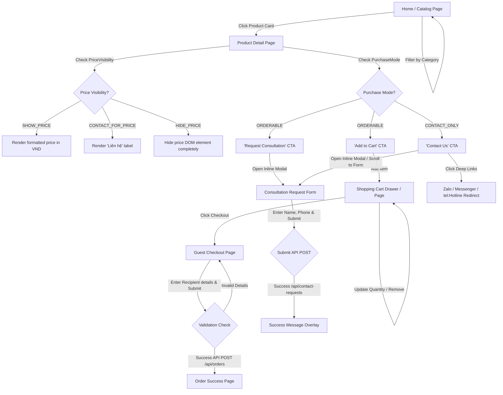
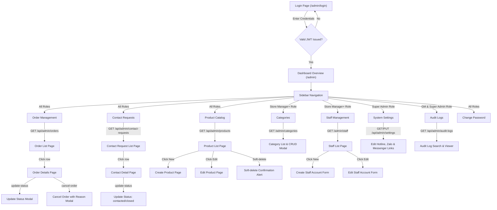

# Site Map, Screen Flow, and Page Specifications

This document defines the website structure (Site Map), user interaction paths (Screen Flow), and additional recommended pages for the **Xe điện Vinfast Happy** Omnichannel E-Commerce Platform (HappyWeb). It bridges the requirements in [SRS-HappyWeb.md](file:///d:/Code/HappyWeb/Software-Requirements-Specification-Kit/Project/SRS-HappyWeb.md) with design/development planning.

---

## 1. Complete Site Map

The site is divided into two distinct environments: the **Public Website** (customer-facing) and the **Internal Operations Dashboard** (role-restricted staff portal).

```text
Xe điện Vinfast Happy Platform (HappyWeb)
├── [Public Website] (Unauthenticated)
│   ├── Home / Product Catalog Page (/)
│   │   └── Category Filter Options (?category=slug)
│   ├── Product Detail Page (/products/[slug])
│   │   ├── Add to Cart CTA (ORDERABLE only)
│   │   ├── Request Consultation CTA (Inline Modal Form)
│   │   └── Static Deep Links (Zalo, Messenger, tel:Hotline)
│   ├── Shopping Cart Page/Drawer (/cart)
│   ├── Guest Checkout Page (/checkout)
│   ├── Order Success Page (/checkout/success)
│   │
│   └── [Recommended Additional Public Pages]
│       ├── About Us & Contact Info (/about-us)
│       ├── Physical Branches Directory (/branches)
│       │   └── Branch Details (/branches/[id])
│       ├── Terms of Service & Data Privacy Policy (/privacy-policy)
│       ├── 404 Page (Not Found handler)
│       └── 500 Page (Internal Server Error handler)
│
└── [Internal Dashboard] (Authenticated, RBAC gated)
    ├── Login Page (/admin/login)
    ├── Self-Service Change Password (/admin/change-password)
    ├── Dashboard Overview /admin (Default landing)
    │   ├── Scoped metrics (Order counts, unresolved contact requests)
    │   └── Branch-scoped stats selector
    ├── Order Management (/admin/orders)
    │   ├── Order List Grid (/admin/orders) - Status, date, & branch filters
    │   └── Order Detail View (/admin/orders/[id])
    │       ├── Update Status Trigger (CONFIRMED -> SHIPPING -> DELIVERED)
    │       └── Cancel Order Trigger (Modal with Optional Reason)
    ├── Contact Request Management (/admin/contact-requests)
    │   ├── Contact List Grid (/admin/contact-requests)
    │   └── Contact Detail View (/admin/contact-requests/[id]) - Update status
    ├── Product & Inventory Catalog (/admin/products)
    │   ├── Product List Grid (/admin/products) - Active/inactive status filters
    │   ├── Create Product Form (/admin/products/new)
    │   └── Edit Product Form (/admin/products/[id]) - Gallery configuration
    ├── Category Management (/admin/categories) - (Store Manager+)
    │   └── Category List Grid & CRUD Modals (/admin/categories)
    ├── Staff Management (/admin/staff) - (Store Manager+)
    │   ├── Staff Accounts Grid (/admin/staff) - Active/Inactive soft-delete status
    │   ├── Create Staff Account Form (/admin/staff/new)
    │   └── Edit Staff Account Form (/admin/staff/[id])
    │
    └── [Recommended Additional Dashboard Pages]
        ├── System Settings (/admin/settings) - (Super Admin only)
        │   └── Configure Hotline, Zalo, Messenger links
        └── System Audit Logs (/admin/audit-logs) - (GM / Super Admin only)
            └── Immutable action log list
```

---

## 2. Screen Flows

### 2.1 Customer / Public Website Flow

This flow illustrates the user progression from browsing to ordering or requesting consultation, governed by the product's `PurchaseMode` and `PriceVisibility`.



### 2.2 Dashboard / Internal Management Flow

This flow highlights how internal staff, managers, and admins navigate the dashboard, restricted by Role-Based Access Control (RBAC).



---

## 3. Recommended Additional Pages (Gap Analysis)

To transform the prototype requirements into a secure, compliant, and user-friendly production-grade system, we recommend adding the following pages. These pages address implicit requirements standard in retail e-commerce.

### 3.1 Public Website Pages

#### 1. Page: Physical Branch Directory (`/branches` & `/branches/[id]`)
- **Reasoning**: The database contains a `Branch` entity (`ENT-ACC-001`) and staff are assigned to branches. For a true omnichannel experience, customers need to find physical store addresses, opening hours, maps, and local phone numbers to verify stock or pick up orders.
- **Key Elements**: Map integration, branch filter by city/region, links to direct Hotline deep links for each branch.

#### 2. Page: Terms of Service & Privacy Policy (`/terms` & `/privacy-policy`)
- **Reasoning**: The guest checkout collects customer names, phone numbers, and addresses. Contact requests collect contact details. Under current data protection laws (such as Vietnam's Decree 13/2023/ND-CP on Personal Data Protection), the website must explicitly present a privacy policy detailing how this data is stored, processed, and secured.
- **Key Elements**: Consent checkmarks, data usage policy, cookies info.

#### 3. Page: About Us & Contact Page (`/about-us` & `/contact`)
- **Reasoning**: A direct hotline and Zalo links exist, but customers require a central "contact" hub with a map of the main store, feedback forms, and company introduction to build brand authority.
- **Key Elements**: Company bio, social media profiles, unified feedback form.

#### 4. Page: 404 (Not Found) & 500 (Server Error) Fallbacks
- **Reasoning**: Essential for UX. If a user inputs an incorrect URL or a product slug is deactivated (soft-deleted), they must be gracefully redirected rather than seeing browser crash screens.
- **Key Elements**: Custom styled "Product not found" message with a CTA to return to the catalog home.

---

### 3.2 Internal Dashboard Pages

#### 1. Page: System Settings Dashboard (`/admin/settings`)
- **Reasoning**: Supports feature `F-ADMIN-007`. Super Admin must have a dedicated GUI to manage the system hotline, Zalo redirect Link, and Messenger redirect link without changing code.
- **Key Elements**: Form inputs validation, visual save indicators, audit log trigger on change.

#### 2. Page: Audit Logs Viewer (`/admin/audit-logs`)
- **Reasoning**: Supports feature `F-ADMIN-008` & `ENT-AUD-001`. Audit logs are collected, but administrators need a dashboard interface to search, filter, and inspect actions to detect unauthorized behavior or track order history issues.
- **Key Elements**: Filters (by actor, date range, action type like `STAFF_CREATED` or `ORDER_CANCELLED`), change diff visualizer (showing JSON differences in human-readable tables).

#### 3. Page: Change Password Panel (`/admin/change-password`)
- **Reasoning**: Supports `FR-AUTH-003`. All staff must have a secure, authenticated self-service page to change their passwords regularly.
- **Key Elements**: Passwords strength checking, confirmation field, session verification.
