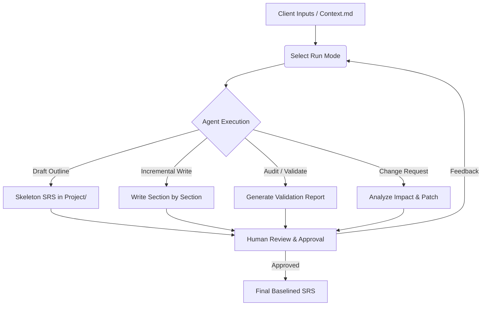
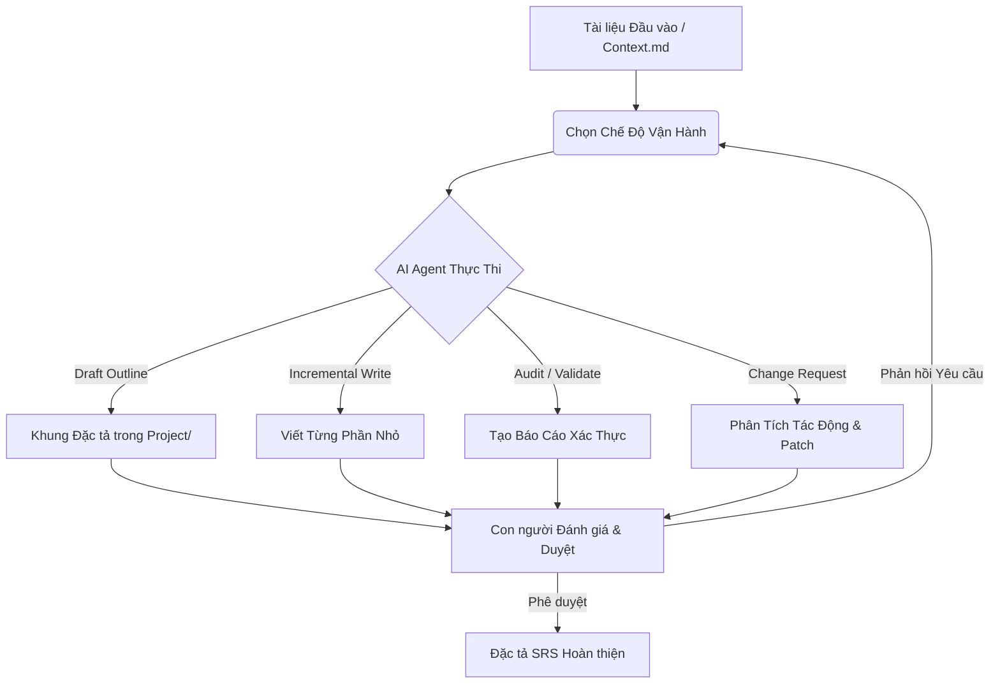

# 🛠️ Software Requirements Specification (SRS) Kit / Bộ Công Cụ Đặc Tả Yêu Cầu Phần Mềm

[](https://www.iso.org/standard/72087.html)
[](https://ears.requirements.org/)
[]()
[]()

---

<details open>
<summary><b>🇺🇸 English Version</b></summary>

## 📖 Overview

The **Software Requirements Specification (SRS) Kit** is a standardized, ISO/IEC/IEEE 29148:2018-compliant framework designed for structured, agent-collaborative requirements engineering. It establishes a rigorous workflow where humans and AI Agents co-author, validate, and maintain requirements. By using EARS (Easy Approach to Requirements Syntax) rules and clear status pipelines, this kit prevents requirement drift, ambiguity, and hallucination.

---

## 🌟 Key Features

*   **Standard-Compliant Architecture**: Built on ISO/IEC/IEEE 29148:2018 requirements engineering principles.
*   **EARS Syntax**: Enforces clear, atomic "shall" statements to keep requirements verifiable and unambiguous.
*   **AI Agent Master Directive**: Contains pre-defined system prompts and rules in `Agent/` ensuring the Agent respects human decisions and follows strict editing guidelines.
*   **5 Operational Run Modes**: Supports everything from high-level bootstrapping (Outline Mode) to localized edits (Patch Mode) and read-only reviews (Audit Mode).
*   **Built-in Validation**: Dual-layer verification (Micro & Macro) to check atomic criteria and overall structural consistency.
*   **Traceability Matrix**: Ensures every requirement is linked to its source and has a verification path.

---

## 📁 Directory Structure

```text
Software Requirements Specification Kit/
├── Agent/                         # AI Agent instructions & workflows
│   ├── 01-Core/                   # Core contracts, run modes, and rules
│   ├── 02-SRS/                    # SRS writing, validation, and change control rules
│   └── AGENTS.md                  # Master Agent Directive (System Instruction)
├── Context/                       # Input documents and structures
│   ├── Context.md.example         # Template for client inputs, briefs, and notes
│   ├── SRS-TOC.md                 # Canonical SRS Table of Contents
│   └── SRS-Template.md            # Markdown template for SRS documents
├── Human/                         # Onboarding and guides for human engineers
│   ├── SRS-About.md               # Concept overview & conventions
│   └── SRS-Guide.md               # Recommended workflow guide
└── Project/                       # Writable directory for generated specifications (Output)
```

### Detailed Breakdown

| Directory | Description |
| :--- | :--- |
| **[`Agent/`](Agent/)** | Contains read-only system instructions for AI Agents. The `AGENTS.md` acts as the master prompt. |
| **[`Context/`](Context/)** | Contains input briefs from clients and templates. `SRS-Template.md` provides the exact structure for output generation. |
| **[`Human/`](Human/)** | Explanatory documentation written for humans on how to use the kit, understand standard requirements, and guide the process. |
| **[`Project/`](Project/)** | The only directory where the Agent is allowed to write or modify files. It stores final SRS documents, validation logs, and audit reports. |

---

## 🔄 Workflow & Run Modes

### Agent-Human Collaboration Workflow


### The 5 Operational Run Modes
1.  **Draft / Outline Mode**: Generates only the table of contents and document control skeleton. Used to align on structure before drafting requirements.
2.  **Incremental Mode (Default)**: Writes/edits the SRS section-by-section to reduce context waste and prevent requirement drift.
3.  **Audit / Validation Mode**: Read-only mode. Evaluates requirements quality, finds conflicts, and generates issues reports without altering the SRS.
4.  **Change Request / Patch Mode**: Performs localized edits after an impact analysis when requirements change.
5.  **Full Generation Mode**: Complete pipeline generation. Only triggered if the target file is empty and mandatory inputs are ready.

---

## ✍️ Writing Conventions

### EARS Requirement Syntax
All functional requirements must use EARS syntax, enforcing the standard "shall" statement:

| Pattern | Trigger Syntax | Example |
| :--- | :--- | :--- |
| **Ubiquitous** | `The [system] shall [action]...` | The system shall retain audit logs for 365 days. |
| **Event-driven** | `When [event], the [system] shall [action]...` | When the user submits valid credentials, the system shall create an authenticated session. |
| **State-driven** | `While [state], the [system] shall [action]...` | While an account is locked, the system shall reject password login attempts. |
| **Unwanted Behavior** | `If [trigger], then the [system] shall [action]...` | If payment authorization fails, then the system shall display the payment failure reason. |
| **Optional Feature** | `Where [feature is active], the [system] shall [action]...` | Where multi-factor authentication is enabled, the system shall require a verification code. |

### Canonical Status Model
Requirements go through a strict lifecycle. **Only Humans can set `APPROVED` status.**

*   `DRAFT`: Created or revised by the Agent, not yet reviewed.
*   `REVIEW`: Under human review / waiting for decision.
*   `APPROVED`: Explicitly accepted by a human. (Immutable for Agents without change requests).
*   `DEPRECATED`: Kept for historical audit but no longer active.

### ID Format
Each item is tracked using a unique identifier: `<TYPE>-<DOMAIN>-<NNN>`
*   `FR-AUTH-001` (Functional Requirement - Authentication)
*   `NFR-PERF-001` (Non-Functional Requirement - Performance)
*   `BR-ORDER-001` (Business Rule - Ordering)
*   `UC-PAY-001` (Use Case - Payment)

---

## 🚀 Getting Started

### 👥 For Humans
1.  **Prepare context**: Copy `Context/Context.md.example` to `Context/Context.md` and put your client briefs, emails, meeting notes, or business goals inside `Context/Context.md` (Note: `Context.md` is ignored by Git to keep your data secure).
2.  **Instruct the Agent**:
    *   *To start a new project*: `"Run Draft Mode on Project/SRS-MyProject.md based on Context/Context.md"`
    *   *To write a feature*: `"Write Section 5 (Product Features) in Project/SRS-MyProject.md"`
    *   *To audit quality*: `"Validate Project/SRS-MyProject.md and create a validation report"`
3.  **Review**: Check files in `Project/`, provide feedback, and mark finalized requirements as `APPROVED`.

### 🤖 For AI Agents
1.  Always read the Master Agent Directive in [`Agent/AGENTS.md`](Agent/AGENTS.md) upon bootstrapping.
2.  Follow the reading sequence defined in Section 3 of `AGENTS.md` (read core contracts first).
3.  Respect the `Project/` folder boundary and protect `APPROVED` requirement states.

---

> [!TIP]
> **Pro Tip:** Make sure to run **Audit / Validation Mode** before finalizing any release candidate SRS to guarantee zero unresolved TBDs or ID duplicates.

</details>

---

<details>
<summary><b>🇻🇳 Bản Tiếng Việt</b></summary>

## 📖 Tổng Quan

**Software Requirements Specification (SRS) Kit** là một bộ công cụ chuẩn hóa, tuân thủ tiêu chuẩn quốc tế **ISO/IEC/IEEE 29148:2018**, được thiết kế cho quy trình kỹ nghệ yêu cầu phần mềm có cấu trúc và có sự phối hợp giữa con người (Human) & AI (Agent). Bộ công cụ thiết lập một quy trình làm việc chặt chẽ giúp đồng tác giả, xác thực và bảo trì các yêu cầu phần mềm. Bằng cách sử dụng quy tắc cú pháp EARS và quy trình chuyển đổi trạng thái rõ ràng, bộ công cụ này giúp ngăn chặn sự trôi lệch yêu cầu, tính mơ hồ và sự suy diễn (hallucination) của AI.

---

## 🌟 Tính Năng Nổi Bật

*   **Kiến trúc chuẩn hóa**: Xây dựng dựa trên các nguyên tắc kỹ nghệ yêu cầu phần mềm chuẩn ISO/IEC/IEEE 29148:2018.
*   **Cú pháp EARS**: Bắt buộc sử dụng các câu lệnh "sẽ/phải" (shall) rõ ràng, mang tính đơn nhất để đảm bảo yêu cầu có thể kiểm chứng và không mơ hồ.
*   **Master Directive cho AI**: Định nghĩa sẵn các chỉ thị hệ thống và quy tắc trong thư mục `Agent/` để đảm bảo Agent tôn trọng quyết định của con người và tuân thủ các quy tắc chỉnh sửa chặt chẽ.
*   **5 Chế độ vận hành**: Hỗ trợ từ việc khởi tạo dự án ở mức cao (Outline Mode) đến cập nhật cục bộ (Patch Mode) và đánh giá chỉ đọc (Audit Mode).
*   **Xác thực tự động**: Xác thực hai lớp (Micro & Macro) để kiểm tra chất lượng của từng yêu cầu riêng lẻ cũng như tính nhất quán của toàn bộ tài liệu.
*   **Ma trận truy xuất nguồn gốc (Traceability)**: Đảm bảo mọi yêu cầu đều được liên kết với nguồn tài liệu gốc và có phương pháp kiểm thử đi kèm.

---

## 📁 Cấu Trúc Thư Mục

```text
Software Requirements Specification Kit/
├── Agent/                         # Hướng dẫn & quy trình cho AI Agent
│   ├── 01-Core/                   # Hợp đồng cốt lõi, chế độ vận hành và quy tắc
│   ├── 02-SRS/                    # Quy tắc viết SRS, xác thực và kiểm soát thay đổi
│   └── AGENTS.md                  # Chỉ thị Master Agent (System Instruction)
├── Context/                       # Tài liệu đầu vào và các biểu mẫu cấu trúc
│   ├── Context.md.example         # File mẫu chứa brief, ghi chú và yêu cầu từ khách hàng
│   ├── SRS-TOC.md                 # Mục lục SRS chuẩn hóa
│   └── SRS-Template.md            # Biểu mẫu Markdown chuẩn để tạo SRS
├── Human/                         # Tài liệu onboarding và hướng dẫn cho con người
│   ├── SRS-About.md               # Tổng quan khái niệm & quy ước sử dụng
│   └── SRS-Guide.md               # Hướng dẫn quy trình làm việc khuyến nghị
└── Project/                       # Thư mục ghi kết quả đặc tả đầu ra (Output)
```

### Chi Tiết Các Thư Mục

| Thư mục | Mô tả |
| :--- | :--- |
| **[`Agent/`](Agent/)** | Chứa các tài liệu chỉ đọc hướng dẫn AI Agent vận hành. File `AGENTS.md` đóng vai trò là system prompt chủ đạo. |
| **[`Context/`](Context/)** | Chứa tài liệu đầu vào từ khách hàng và các biểu mẫu. File `SRS-Template.md` định nghĩa cấu trúc đặc tả chuẩn. |
| **[`Human/`](Human/)** | Tài liệu hướng dẫn giải thích cho con người cách sử dụng bộ công cụ, cách viết yêu cầu chuẩn và điều phối dự án. |
| **[`Project/`](Project/)** | Khu vực ghi duy nhất của Agent. Nơi chứa các tài liệu đặc tả (SRS) được tạo ra, log kiểm tra và báo cáo xác thực. |

---

## 🔄 Quy Trình & Các Chế Độ Vận Hành

### Quy trình Phối hợp Con người - AI


### 5 Chế Độ Vận Hành Chi Tiết
1.  **Draft / Outline Mode (Khởi tạo/Phác thảo)**: Chỉ tạo mục lục và khung quản lý tài liệu. Dùng để thống nhất cấu trúc trước khi viết chi tiết.
2.  **Incremental Mode (Viết tăng trưởng - Mặc định)**: Viết hoặc sửa đổi SRS theo từng phần nhỏ để giảm hao phí ngữ cảnh và tránh trôi lệch yêu cầu.
3.  **Audit / Validation Mode (Kiểm tra/Xác thực)**: Chế độ chỉ đọc. Đánh giá chất lượng các yêu cầu, phát hiện mâu thuẫn và tạo báo cáo lỗi mà không thay đổi file SRS.
4.  **Change Request / Patch Mode (Cập nhật/Sửa đổi)**: Thực hiện sửa đổi cục bộ sau khi phân tích tác động từ các thay đổi yêu cầu đầu vào.
5.  **Full Generation Mode (Tạo toàn bộ)**: Chạy quy trình tạo toàn bộ tài liệu đặc tả. Chỉ kích hoạt khi file đầu ra trống và các tài liệu đầu vào bắt buộc đã sẵn sàng.

---

## ✍️ Quy Ước Viết Yêu Cầu

### Cú Pháp Viết Yêu Cầu EARS
Mọi yêu cầu chức năng phải sử dụng cú pháp EARS, áp dụng câu lệnh chuẩn "sẽ/phải" (shall):

| Dạng yêu cầu | Cú pháp kích hoạt | Ví dụ |
| :--- | :--- | :--- |
| **Ubiquitous**<br>*(Bất biến)* | `Hệ thống sẽ [hành động]...` | Hệ thống sẽ lưu giữ nhật ký kiểm toán trong 365 ngày. |
| **Event-driven**<br>*(Kích hoạt bằng sự kiện)* | `Khi [sự kiện], hệ thống sẽ [hành động]...` | Khi người dùng gửi thông tin đăng nhập hợp lệ, hệ thống sẽ tạo một phiên làm việc đã xác thực. |
| **State-driven**<br>*(Trạng thái kích hoạt)* | `Trong khi [trạng thái], hệ thống sẽ [hành động]...` | Trong khi tài khoản đang bị khóa, hệ thống sẽ từ chối các nỗ lực đăng nhập bằng mật khẩu. |
| **Unwanted Behavior**<br>*(Xử lý lỗi/Ngoại lệ)* | `Nếu [kích hoạt], hệ thống sẽ [hành động]...` | Nếu xác thực thanh toán thất bại, hệ thống sẽ hiển thị lý do thất bại. |
| **Optional Feature**<br>*(Tính năng tùy chọn)* | `Ở nơi [tính năng bật], hệ thống sẽ [hành động]...` | Ở nơi xác thực đa yếu tố được bật, hệ thống sẽ yêu cầu một mã xác minh. |

### Mô Hình Trạng Thái Yêu Cầu
Yêu cầu trải qua vòng đời quản lý trạng thái chặt chẽ. **Chỉ Con người mới có quyền đổi trạng thái sang `APPROVED`.**

*   `DRAFT`: Yêu cầu được Agent tạo mới hoặc sửa đổi, chưa được đánh giá.
*   `REVIEW`: Yêu cầu sẵn sàng để con người đánh giá hoặc chờ quyết định.
*   `APPROVED`: Được phê duyệt chính thức bởi con người (Agent không được tự ý sửa đổi khi đã ở trạng thái này).
*   `DEPRECATED`: Được giữ lại để đối chiếu lịch sử nhưng không còn hiệu lực.

### Định Dạng Mã Yêu Cầu (ID)
Mỗi mục yêu cầu được theo dõi bằng mã định dạng duy nhất: `<TYPE>-<DOMAIN>-<NNN>`
*   `FR-AUTH-001` (Yêu cầu chức năng - Xác thực)
*   `NFR-PERF-001` (Yêu cầu phi chức năng - Hiệu năng)
*   `BR-ORDER-001` (Quy tắc nghiệp vụ - Đặt hàng)
*   `UC-PAY-001` (Use Case - Thanh toán)

---

## 🚀 Hướng Dẫn Bắt Đầu

### 👥 Dành cho Con người (Human)
1.  **Chuẩn bị thông tin đầu vào**: Sao chép file `Context/Context.md.example` thành `Context/Context.md` và đưa brief khách hàng, email, ghi chú cuộc họp vào file mới tạo `Context/Context.md` này. (Lưu ý: `Context.md` đã được bỏ qua trong Git để bảo mật dữ liệu của bạn).
2.  **Ra lệnh cho AI Agent**:
    *   *Để khởi tạo dự án*: `"Run Draft Mode on Project/SRS-MyProject.md based on Context/Context.md"`
    *   *Để viết một tính năng*: `"Write Section 5 (Product Features) in Project/SRS-MyProject.md"`
    *   *Để kiểm tra chất lượng*: `"Validate Project/SRS-MyProject.md and create a validation report"`
3.  **Đánh giá & Phê duyệt**: Xem xét các file được tạo trong thư mục `Project/`, đưa ra phản hồi chỉnh sửa và cập nhật trạng thái các yêu cầu đã chốt thành `APPROVED`.

### 🤖 Dành cho AI Agent
1.  Luôn đọc hướng dẫn Master Agent Directive trong file [`Agent/AGENTS.md`](Agent/AGENTS.md) khi bắt đầu phiên làm việc.
2.  Tuân thủ thứ tự đọc tài liệu cốt lõi đã quy định ở Mục 3 trong file `AGENTS.md`.
3.  Tôn trọng giới hạn thư mục ghi `Project/` và bảo vệ các yêu cầu đã phê duyệt (`APPROVED`).

---

> [!TIP]
> **Mẹo hữu ích:** Hãy chạy chế độ **Audit / Validation Mode** trước khi bàn giao tài liệu đặc tả cuối cùng để đảm bảo không còn bất kỳ mục TBD (thông tin còn thiếu) hoặc trùng lặp ID yêu cầu nào.

</details>

---
